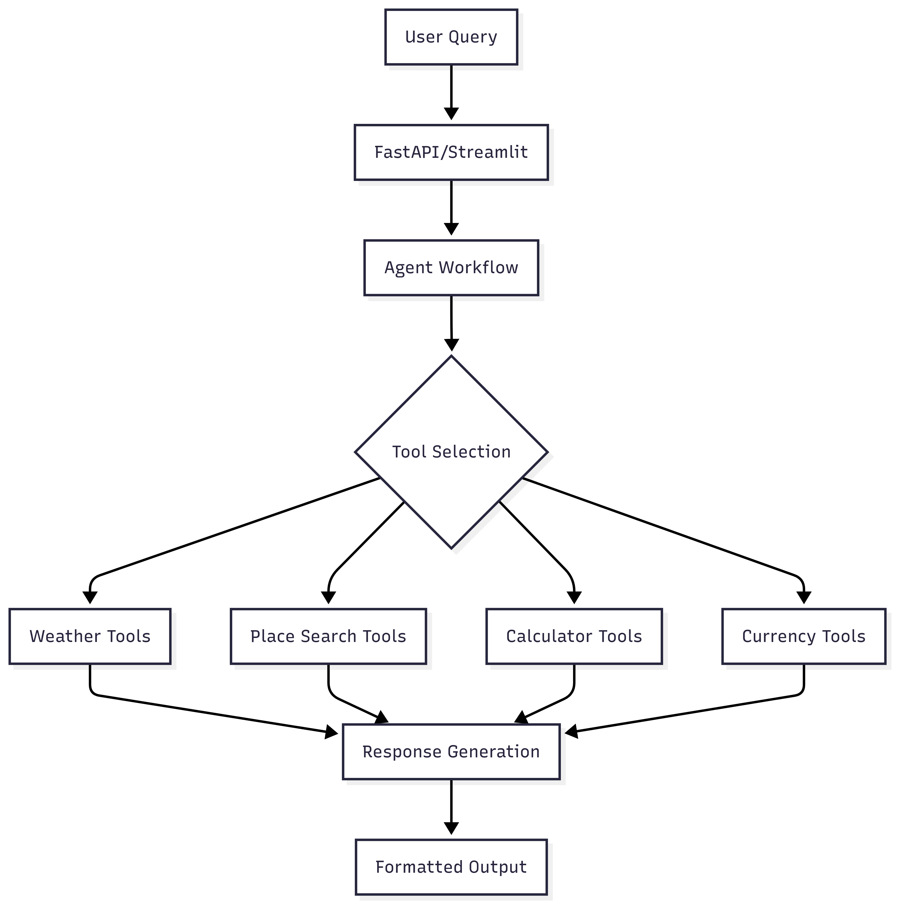

# 🌍 AI Travel Planner - Agentic Workflow System

An intelligent AI-powered travel planning application that leverages multi-agent workflows, real-time data integration, and advanced language models to create comprehensive travel itineraries with detailed cost breakdowns.

## 🚀 Features

### Core Capabilities
- **🤖 Multi-Agent Architecture**: Built with LangGraph for sophisticated agentic workflows
- **🌦️ Real-Time Weather Integration**: Live weather forecasts and current conditions
- **🗺️ Smart Place Discovery**: Google Places API + Tavily search for attractions, restaurants, and activities
- **💰 Dynamic Cost Calculations**: Automated expense planning and budget breakdowns
- **💱 Currency Conversion**: Real-time exchange rates for international travel
- **📱 Dual Interface**: Both REST API and Streamlit web interface

### AI-Powered Features
- **Comprehensive Itineraries**: Day-by-day travel plans with detailed recommendations
- **Off-Beat Locations**: Alternative suggestions beyond typical tourist spots
- **Smart Fallbacks**: Multiple data sources ensure reliable information retrieval
- **Personalized Budgeting**: Tailored cost estimates based on travel preferences

## 🏗️ Architecture

System Components
GraphBuilder: Orchestrates the multi-agent workflow using LangGraph

Tool Suite: Modular tools for weather, places, calculations, and currency

Model Flexibility: Support for multiple LLM providers (Groq, OpenAI)

Robust Error Handling: Graceful fallbacks and comprehensive error management

🛠️ Installation
Prerequisites
Python 3.10+

API Keys for external services (see Environment Setup)

Quick Start with UV:->
# Install UV package manager
pip install uv

# Clone repository
git clone https://github.com/yourusername/ai-travel-planner.git
cd ai-travel-planner

# Create virtual environment
uv venv env --python cpython-3.10.18

# Activate environment (Windows)
env\Scripts\activate.bat
# Or Linux/Mac
source env/bin/activate

# Install dependencies
uv add pandas fastapi uvicorn streamlit langchain-groq langgraph python-dotenv requests

# Traditional Installation

git clone https://github.com/yourusername/ai-travel-planner.git
cd ai-travel-planner
pip install -r requirements.txt

Required API Keys
Groq/OpenAI: For LLM inference

OpenWeatherMap: Weather data

Google Places: Location and business data

ExchangeRate-API: Currency conversion

Tavily: Fallback search functionality
